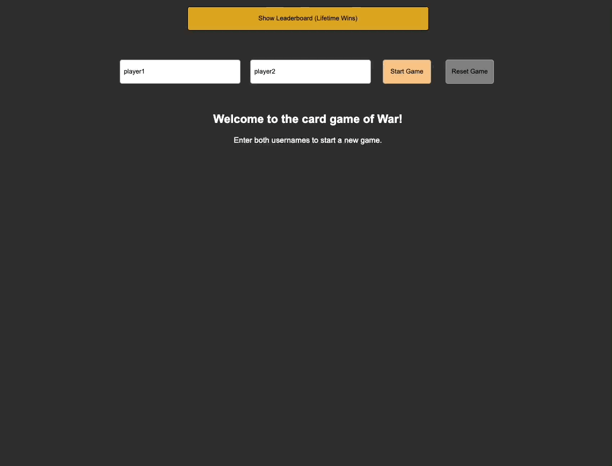

# War (card game)

## Table of Contents

-   [Description](https://github.com/willkee/wargame#description)
-   [Link to Live Site](https://github.com/willkee/wargame#link-to-live-site)
-   [Technologies](https://github.com/willkee/wargame#technologies)
-   [Getting Started](https://github.com/willkee/wargame#getting-started)
-   [Gameplay](https://github.com/willkee/wargame#gameplay)
-   [Future Development Ideas](https://github.com/willkee/wargame#future-development-ideas)

<br>

## Description

War is a simple card game where the goal is to accumulate all of the cards. When one player accumulates all the cards, that player wins and the game is over. The game starts with the 52 card deck shuffled and split evenly between two players. (26 cards each).

Each player will draw a card and place it on the table face up. The player with the highest card takes both cards and places them at the bottom of their deck. Suits are ignored. The 2 is the lowest and Ace is the highest.

If they are the same rank, it is War. 

When a War occurs, each player places one card face down, and another card face up from their deck. The face up cards are compared to see which has a higher rank. If there is no tie, the player with the higher card takes all of the cards on the table (face up and face down) and places them at the bottom of their deck. If there is another tie, each player places another card face down and another card face up. The face up cards are compared again. This process repeats itself until there is no longer a tie between the face up cards.

If a player runs out of cards during War (unable to put down enough cards to fulfill their side of the war), that player loses and their opponent wins the game.

---

## Link to Live Site

This site may take about 20 seconds to load if it has been 'sleeping'.

[War](https://wk-wargame.herokuapp.com/)

---

## Technologies

<p float="left">

  
  &nbsp;
  
  &nbsp;
  
  &nbsp;
  
  &nbsp;
  
  &nbsp;
  
  &nbsp;
  
  &nbsp;
  
  &nbsp;

</p>

---

## Getting Started

These installation instructions are assuming you have a version of Node.js installed as well as NPM.

You may install Node from this site: [Node.js](https://nodejs.org/en/download/). 
Here are the docs for NPM if you don't have it installed: [NPM](https://docs.npmjs.com/downloading-and-installing-node-js-and-npm).

<br/>

1. Clone this repository by entering either line below into your terminal where you want the cloned folder to reside.

```
git clone https://github.com/willkee/wargame.git

or

git clone git@github.com:willkee/wargame.git
```

<br>

2. Navigate to the cloned directory (root directory) and install all dependencies.

```
npm install
```

<br>

3. Create a user on PostgreSQL (psql) with a PASSWORD and CREATEDB privileges. Remember your chosen username and password.

```
CREATE USER <username> WITH PASSWORD <password> CREATEDB;
```

<br>

4.  In the backend directory, create a `.env` file based on the `.env.example` file. For `DB_USERNAME` and `DB_PASSWORD`, enter your chosen username and password from Step 3.

<br>

5. Run the following code in your backend directory to run the creation of the database and migrations as well as to seed the database.

```
npx dotenv sequelize db:create
npx dotenv sequelize db:migrate
npx dotenv sequelize db:seed:all
```

<br>

6.  Start the backend and frontend servers in their respective directories with `npm start`. Your browser should open the application automatically. If not, navigate to `http://localhost:3000` in your browser.

<br>

7. Enter your desired usernames for Player One and Player Two and select `Start Game` to begin.

8. To draw cards, select `Draw Cards`. To continue to the next round, select `Continue`.

9. The game will automatically end and display the winner once one player runs out of cards. 

10. There will be an option to submit the winner's username to the Leaderboard upon game completion.

11. Users may select `Reset Game` to select new usernames (or re-use them!) and play again.

<br>

## Gameplay



<br>

## Future Development Ideas

- One of the first things I would add in a future development would be to make user authentication with log in credentials and cookies. This will protect someone else from accidentally (or intentionally!) incrementing another user's wins. 

- While this will preserve the name of the user currently logged in on browser refresh, the game state will still be lost. (Don't hard refresh during the game!)

- This will make it so a player will exclusively be playing against the computer. Since there's no strategy involved (entirely luck based on the shuffle), the game logic will remain the same.

- Further styling changes to make the playing cards look like real playing cards.

